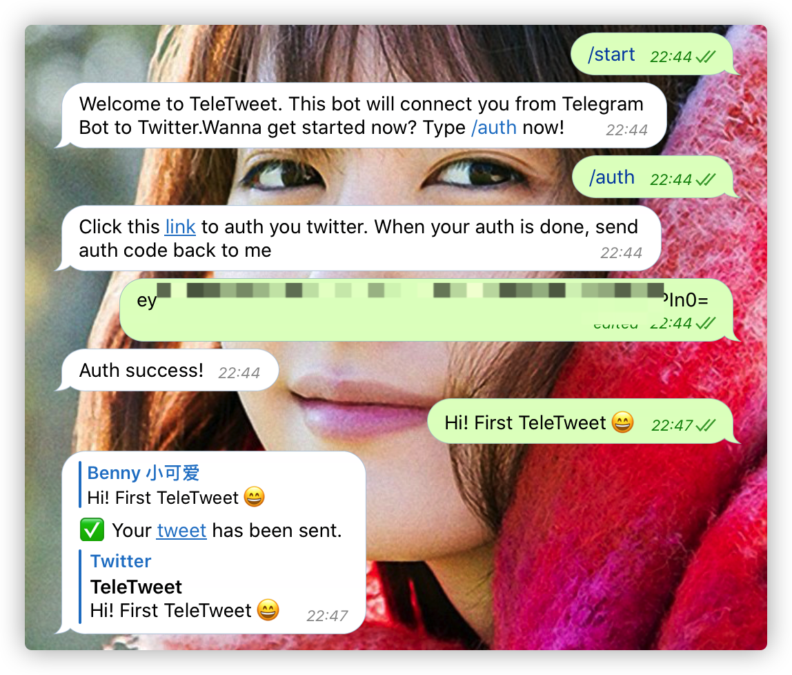

# TwitterBot
🦉 A telegram Twitter bot that will allow you to send tweets!

[TeleTweet](https://t.me/tele_tweetbot)

# Warning
## 1. Early development 
This bot is still under **early development process**. Anything may subject to change.
## 2. Data security
You need to use oauth to use this bot, and this bot will **save your oauth token** in its file system.
Under this circumstance, it means: 1). The bot will have access to your Twitter data 
2). the oauth token has been encrypted by AES-128-CBC. 
However, due to technical limitation, the encryption key is **available from host machine**, 
but I promise I won't do anything with your twitter account.
## 3. oauth token
The token was saved with **AES-128-CBC**, and the key is **available from the host machine**.
This means anyone have access to host machine could acquire key and decrypt the token.

Anyway, I promise I won't touch your token and Twitter account 
and I'll **do everything I can** to secure my host machine.

It's just like you're using a third party Twitter App, you trust it so you choose to use it. It's just like that.

Nevertheless, you could try to deploy your own bot - it's an open source project, you know.

# screenshots


# Commands
```
start - Start using it today
sign_in - Go to sign in with Twitter
sign_off - sign off from Twitter
help - What is this bot
ping - Status about this bot
```
# Usage
Chat with [this bot](https://t.me/tele_tweetbot), and go to oauth by its instruction:


Copy and paste the auth code to this bot. And you're good to go!
Send any text message, photo/photo as file with caption will send tweet with photos.



# Features
* send text tweet
* send tweet with one photo(photo and document are supported.)

# General deployment
This bot use oauth, so you need to apply an app, setup callback url.
More info could be seen [here](https://github.com/twitterdev/twauth-web).

## bot
```shell script
git clone https://github.com/tgbot-collection/TeleTweet/
cd TeleTweet
pip3 install -r requirements.txt
export TOKEN="BOT_TOKEN" \
 CONSUMER_KEY="key"  CONSUMER_SECRET="secret" \
touch teletweet/database.enc
python3 teletweet/bot.py
```
## web server
```shell script
vim twauth.py
# change this three lines to your own
APP_CONSUMER_KEY = os.environ.get("CONSUMER_KEY") or '1'
APP_CONSUMER_SECRET = os.environ.get("CONSUMER_SECRET") or '2'
callback_url = os.environ.get("CALLBACK_URL") or "http://127.0.0.1:8888/callback"

# run it
python3 twauth.py
```

# Docker
You can run using docker.
```shell script
docker run -d --restart=always -e TOKEN="BOT_TOKEN" \
-e CONSUMER_KEY="key" -e CONSUMER_SECRET="secret" \
-v `pwd`/database.enc:/TeleTweet/teletweet/database.enc \
bennythink/teletweet

docker run -d --restart=always -e TOKEN="BOT_TOKEN" \
-e CONSUMER_KEY="key" -e CONSUMER_SECRET="secret"  \
bennythink/teletweet python3 /TeleTweet/twauth-web/twuath.py
```

# Plans
- [x] support multi-user, based on oauth, encrypted with AES-128-CBC
- [x] help
- [x] about
- [x] start
- [ ] timeline
- [ ] new
- [ ] like

# Credits
* [twauth-web](https://github.com/twitterdev/twauth-web)


# FAQ
## connection reset by peer - twauth-web
If you ran into this problem when using twauth-web, probably you need to upgrade your Python.
Try to pyenv and install a latest version of Python, and this will be likely be fixed.

# License
GPL 2.0